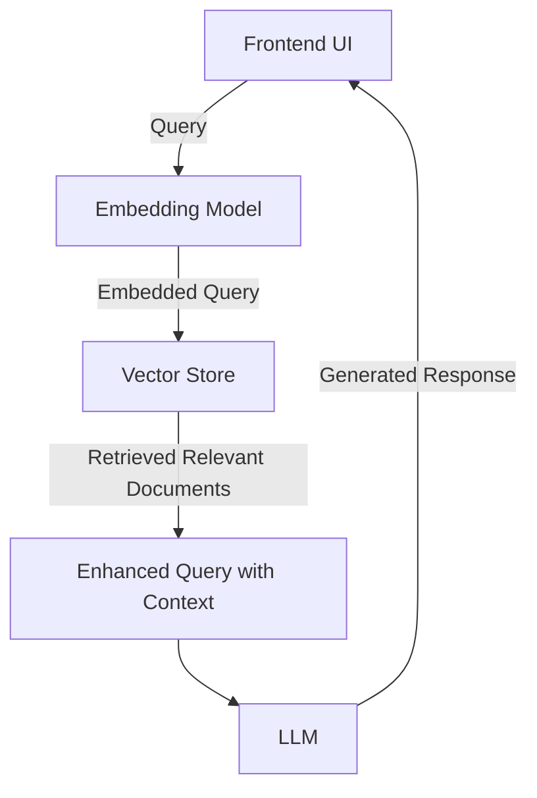
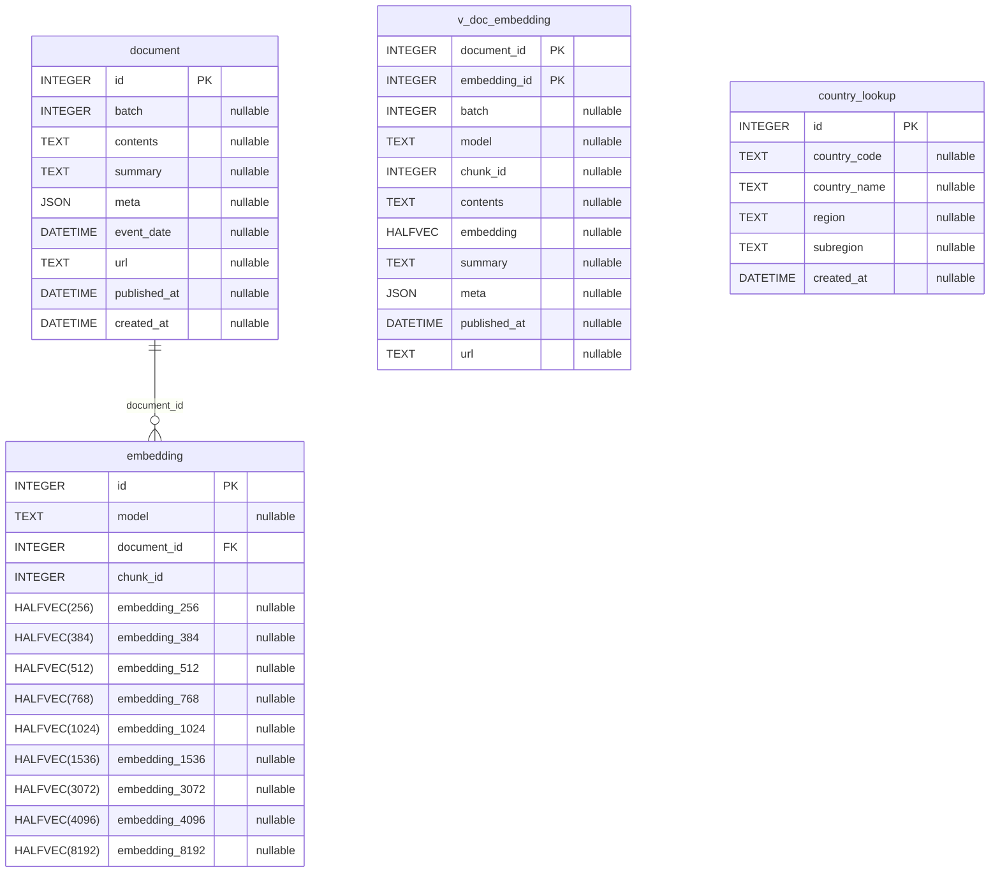
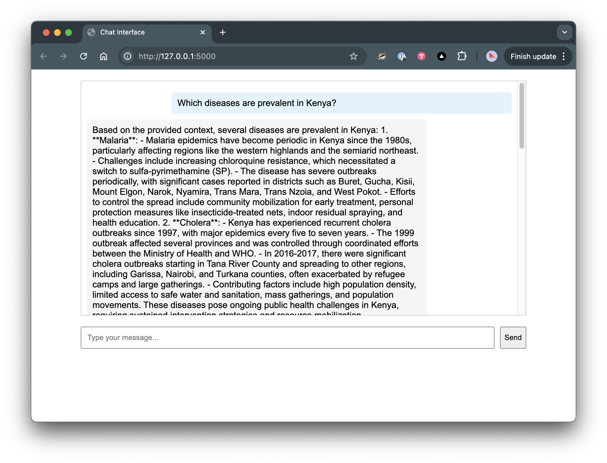

# RAG for Malaria Outbreaks

**How can multi-modal data fusion inform and enhance the prediction and reporting of malaria outbreaks?**


- [RAG for Malaria Outbreaks](#rag-for-malaria-outbreaks)
  - [Introduction](#introduction)
  - [Getting Started](#getting-started)
    - [Python Environment](#python-environment)
    - [Database Setup](#database-setup)
    - [Schema](#schema)
    - [LangChain](#langchain)
    - [Data](#data)
      - [Acquisition \& Pre-Processing](#acquisition--pre-processing)
      - [Data Ingestion](#data-ingestion)
    - [LLM](#llm)
      - [Ollama](#ollama)
      - [Embeddings](#embeddings)
      - [Retrieval](#retrieval)
    - [UI](#ui)
  - [Evaluation](#evaluation)
    - [Sample Questions](#sample-questions)
    - [Notes on Batches](#notes-on-batches)
      - [Batch 0](#batch-0)
      - [Batch 1](#batch-1)
  - [Cosine Similarity in Vector Search](#cosine-similarity-in-vector-search)
    - [What is Cosine Similarity?](#what-is-cosine-similarity)
    - [Cosine Distance](#cosine-distance)
    - [Interpreting Results](#interpreting-results)
  - [References](#references)
    - [YouTube](#youtube)
    - [Articles](#articles)
    - [Repos](#repos)
    - [Data](#data-1)
    - [Scientific Papers](#scientific-papers)
    - [Technical Articles](#technical-articles)


## Introduction

This repository contains the code for my master's thesis project. It is designed to be self-contained and can be run with or without knowledge of the paper's broader context.

The repository contains all required elements for a running RAG application, from data collection, pre-processing through storage, retrieval and generation.

The corresponding text can be found in this [Google Doc](https://docs.google.com/document/d/1yrXBIel38MnqWNlNvMyZ0F4Ly4uRXjIqJBo9NjEtcms).

## Getting Started

This RAG application consists of various elements. The setup of each is detailed below:



### Python Environment

For ease of use, this setup guide has been written with [Anaconda](https://www.anaconda.com/download) in mind, however, it should work equally well with other Python environments.

On MacOS you must install a native ARM build if you are running on Apple Silicon (M processors). Otherwise, Python will default to x86 builds which will run in Rosetta (i.e. under emulation) and ML will not run at all. See also [here](https://stackoverflow.com/questions/65415996/how-to-specify-the-architecture-or-platform-for-a-new-conda-environment-apple).

```sh
CONDA_SUBDIR=osx-arm64 conda create --name pg-vector-rag python=3.12 -c conda-forge
conda activate pg-vector-rag
pip install -r requirements.txt
```

Should you need to remove the environment and start fresh for any reason:

```sh
conda env remove --name pg-vector-rag
```

### Database Setup

This project uses the [pgvector](https://github.com/pgvector/pgvector) Postgres extension as a vector store. This allows the data to be stored alongside the embeddings and as such both can be accessed easily through any SQL querying utility.

If you do not wish to run this locally, a cloud-based service such as [Supabase](https://supabase.com/modules/vector) could also be used.

There is a [docker-compose.yml](./app/docker/docker-compose.yml) which sets up a local PGVector instance as a [Docker](https://www.docker.com/products/docker-desktop/) container. **Note:** Please create an empty subdirectory `pgvector_data` before bringing the container up for the first time. This will be mounted as a volume within the Docker container.

```sh
mkdir pgvector_data
docker compose up -d
```

Next, move to the [app/db](./app/db/) folder and prepare the vector store. Ensure you have a `.env` file present (use the provided [.example.env](./.example.env) for guidance) and run:

```sh
python create_db.py
```


### Schema
<!-- BEGIN_SQLALCHEMY_DOCS -->

<!-- END_SQLALCHEMY_DOCS -->


### LangChain

This code uses [LangChain](https://python.langchain.com/docs/introduction/) to abstract away some of the lower-level interactions with our LLMs and data.

At the time of writing (Jan 2025) LangChain is quite far behind in the version of pgvector it supports (v0.2.5 – current version is v0.3.6). There is an open [PR](https://github.com/langchain-ai/langchain-postgres/pull/147) for supporting the new features (especially support for the sparse vector type `halfvec`).
This version of the code can be installed directly from GitHub:

```sh
pip install git+https://github.com/langchain-ai/langchain-postgres@c32f6beb108e37aad615ee3cbd4c6bd4a693a76d
```

### Data

A list of interesting data sources pertaining to malaria and other tropical diseases can be found in the subfolders under [./data-collectio](./data-collection/). The code in this repo currently uses data scraped from [WHO DONs](./data-collection/acquisition/WHO%20DONs/) to populate our RAG knowledgebase. It should be fairly straightforward to adapt it to other sources.

#### Acquisition & Pre-Processing

See [./app/who-don-retriever/](./app/who-don-retriever/) for scripts to scrape and clean the data. In this directory, you'll also find a [README](./app/who-don-retriever/README.md) outlining the process.

**Note:** At the time of writing, a non-packaged version of the Markdownify library must be installed:

```sh
pip install git+https://github.com/matthewwithanm/python-markdownify@3026602686f9a77ba0b2e0f6e0cbd42daea978f5
```

#### Data Ingestion

Populate the document store by running:

```sh
python load_documents.py
```

This will read


### LLM

All components of this application can be run locally without accessing resources in the cloud. This includes the language and embedding models.

#### Ollama

[Ollama](https://ollama.com/) makes it easy to run LLMs locally. Download and run the installer. Once installed, run your model of choice, e.g.:

```
export OLLAMA_HOST=0.0.0.0
export OLLAMA_KEEP_ALIVE=15m
export OLLAMA_FLASH_ATTENTION=true
export OLLAMA_KV_CACHE_TYPE=q8_0
ollama run phi4
```

By default, Ollama will expose its API on port 11434. Also, by default, Ollama will limit its context window to 2048 tokens. This is too low for our use case. Therefore, we should adjust it before running our model or simply create our own version with an expanded context window:

```
...
>>> /set parameter num_ctx 16768
>>> /save bla
>>> /bye
...
```


#### Embeddings

By default, this app uses the [all-MiniLM-L6-v2](https://www.sbert.net/) Sentence Transformer model to generate the embeddings for our vector store. An other model which works well for embeddings is [nomic-embed-text-v1.5](https://www.nomic.ai/blog/posts/nomic-embed-text-v1). Run the following to pull the model into Ollama:

```sh
ollama pull all-minilm
```

Once ready, run [./app/db/load_embeddings.py](./app/db/load_embeddings.py):

```sh
python load_embeddings.py
```

**Note:** This will take some time to process – expect at least 15 minutes on a modern Mac laptop.

#### Retrieval

TODO:

### UI

If you've made it this far – great! At this point, run the front-end application (from within the [app](./app/) directory):

```sh
flask run
```

You should now be able to reach the chat-style interface at http://127.0.0.1:5000.





## Evaluation

### Sample Questions

- In which countries is Malaria most prevalent?
- Which diseases are prevalent in Kenya?
- Which were the largest disease outbreaks in the last 20 years?
- Where were outbreaks with the most severe impacts, e.g. deaths?


### Notes on Batches

#### Batch 0

- Baseline attempt
- DONs were put together from two fields mainly
- Embeddings loaded for nomic and embed-all
- I think this data is now stored in backup tables in the db (check)

#### Batch 1

- Refined attempt
- Full DONs were pieced together from all relevant fields
- The documents were distilled into Markdown storage for the db
- Vectors were then taken from them for both nomic and embed-all (sometimes exceeding context window)
- Side quest: The Markdown docs were summarized with gpt-4o-mini
- Could make a Batch 2 with embeddings for these summaries
- Alternatively, these could be embedded inline as processing of the requests happens (though embedding is slow)


## Cosine Similarity in Vector Search

### What is Cosine Similarity?

Cosine similarity measures the cosine of the angle between two vectors in a multi-dimensional space. It's a measure of orientation rather than magnitude.

- Range: -1 to 1 (for normalized vectors, which is typical in text embeddings)
- 1: Vectors point in the same direction (most similar)
- 0: Vectors are orthogonal (unrelated)
- -1: Vectors point in opposite directions (most dissimilar)

### Cosine Distance

In pgvector, the `<=>` operator computes cosine distance, which is 1 - cosine similarity.

- Range: 0 to 2
- 0: Identical vectors (most similar)
- 1: Orthogonal vectors
- 2: Opposite vectors (most dissimilar)

### Interpreting Results

When you get results from similarity_search:

- Lower distance values indicate higher similarity.
- A distance of 0 would mean exact match (rarely happens with embeddings).
- Distances closer to 0 indicate high similarity.
- Distances around 1 suggest little to no similarity.
- Distances approaching 2 indicate opposite meanings (rare in practice).


## References

### YouTube

- [Reliable, fully local RAG agents with LLaMA3.2-3b - Langchain](https://www.youtube.com/watch?v=bq1Plo2RhYI)
- [Generate LLM Embeddings On Your Local Machine](https://www.youtube.com/watch?v=8L3tGcYc774&t=29s)
- [Don’t Embed Wrong! - Matt Williams](https://www.youtube.com/watch?v=76EIC_RaDNw)
- [Python RAG Tutorial (with Local LLMs): AI For Your PDFs – pixegami](https://www.youtube.com/watch?v=2TJxpyO3ei4)
- [AI for Good: Defeating Dengue with AI](https://www.youtube.com/watch?v=kPevp4f2CWw)


### Articles

- [Retrieval Augmented Generation (RAG) with pgvector vector database](https://medium.com/@yogi_r/retrieval-augmented-generation-rag-with-pgvector-vector-database-0d741e14d62f)


### Repos

- [Building a High-Performance RAG Solution with Pgvectorscale and Python](https://github.com/daveebbelaar/pgvectorscale-rag-solution/tree/setup)
- [https://github.com/ryogesh/llm-rag-pgvector](https://github.com/ryogesh/llm-rag-pgvector)
- [Swiss TPH OpenMalaria Wiki](https://github.com/SwissTPH/openmalaria/wiki)
- [technovangelist](https://github.com/technovangelist)
- [https://github.com/AlbertoFormaggio1/conversational_rag_web_interface](https://github.com/AlbertoFormaggio1/conversational_rag_web_interface)
- [https://github.com/nlmatics/nlm-ingestor](https://github.com/nlmatics/nlm-ingestor)
- [https://github.com/nlmatics/llmsherpa](https://github.com/nlmatics/llmsherpa)
- [https://github.com/segment-any-text/wtpsplit](https://github.com/segment-any-text/wtpsplit)
- [https://github.com/aws-samples/layout-aware-document-processing-and-retrieval-augmented-generation](https://github.com/aws-samples/layout-aware-document-processing-and-retrieval-augmented-generation)
- [https://github.com/aurelio-labs/semantic-chunkers](https://github.com/aurelio-labs/semantic-chunkers)


### Data

- [UNData](https://data.un.org/Data.aspx?d=WHO&f=MEASURE_CODE%3aWHS3_48)
- [WHO Malaria Factsheet](https://www.who.int/news-room/fact-sheets/detail/malaria)
- [Swiss TPH - Malaria](https://www.swisstph.ch/en/topics/malaria)

### Scientific Papers

- [Leveraging computational tools to combat malaria: assessment and development of new therapeutics](https://link.springer.com/article/10.1186/s13321-024-00842-z?fromPaywallRec=false)
- [Systematic review on the application of machine learning to quantitative structure–activity relationship modeling against Plasmodium falciparum](https://link.springer.com/article/10.1007/s11030-022-10380-1)
- [Predicting malaria outbreaks using earth observation measurements and spatiotemporal deep learning modelling: a South Asian case study from 2000 to 2017](https://www.thelancet.com/journals/lanplh/article/PIIS2542-5196(24)00082-2/fulltext)
- [New Study uses AI to predict malaria outbreaks in South Asia](https://www.ndorms.ox.ac.uk/news/new-study-uses-ai-to-predict-malaria-outbreaks-in-south-asia)

### Technical Articles

- [Load vector embeddings up to 67x faster with pgvector and Amazon Aurora](https://aws.amazon.com/blogs/database/load-vector-embeddings-up-to-67x-faster-with-pgvector-and-amazon-aurora/)
- [TF-IDF and BM25 for RAG— a complete guide](https://www.ai-bites.net/tf-idf-and-bm25-for-rag-a-complete-guide/)
- [Chunking Strategies for LLM Applications](https://www.pinecone.io/learn/chunking-strategies/)
- [Simplifying RAG with PostgreSQL and PGVector](https://medium.com/@levi_stringer/rag-with-pg-vector-with-sql-alchemy-d08d96bfa293)
- [Unleashing the power of vector embeddings with PostgreSQL](https://tembo.io/blog/pgvector-and-embedding-solutions-with-postgres)
- [PostgreSQL Extensions: Turning PostgreSQL Into a Vector Database With pgvector](https://www.timescale.com/learn/postgresql-extensions-pgvector)
- [Late Chunking in Long-Context Embedding Models](https://jina.ai/news/late-chunking-in-long-context-embedding-models/)
- [Chunk + Document Hybrid Retrieval with Long-Context Embeddings (Together.ai)](https://docs.llamaindex.ai/en/stable/examples/retrievers/multi_doc_together_hybrid/)
- [Retrieval Augmented Generation (RAG) for LLMs](https://www.promptingguide.ai/research/rag)
- [Build your RAG web application with Streamlit](https://medium.com/@alb.formaggio/build-your-rag-web-application-with-streamlit-7673120a9741)
- [Auto-Merging: RAG Retrieval Technique](https://dev.to/rutamstwt/auto-merging-rag-retrieval-technique-4d6m)
